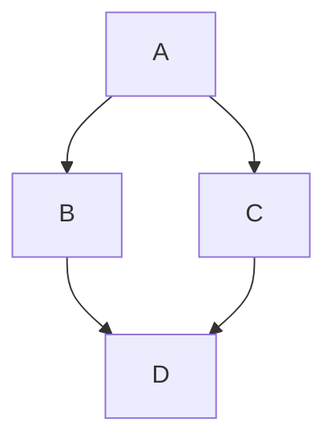

<!-- Licensed to the Apache Software Foundation (ASF) under one-->
<!-- or more contributor license agreements.  See the NOTICE file-->
<!-- distributed with this work for additional information-->
<!-- regarding copyright ownership.  The ASF licenses this file-->
<!-- to you under the Apache License, Version 2.0 (the-->
<!-- "License"); you may not use this file except in compliance-->
<!-- with the License.  You may obtain a copy of the License at-->
<!---->
<!--   http://www.apache.org/licenses/LICENSE-2.0-->
<!---->
<!-- Unless required by applicable law or agreed to in writing,-->
<!-- software distributed under the License is distributed on an-->
<!-- "AS IS" BASIS, WITHOUT WARRANTIES OR CONDITIONS OF ANY-->
<!-- KIND, either express or implied.  See the License for the-->
<!-- specific language governing permissions and limitations-->
<!-- under the License.-->

# Mermaid Diagrams

Doxia Sitetools can optionally embed the necessary Javascript to render [Mermaid](https://mermaid.ai/open-source/) diagrams client-side (supported since [m-site-p 3.22.0](https://github.com/apache/maven-doxia-sitetools/issues/611)).

<!-- MACRO{toc|fromDepth=2} -->

## Setup

In order to enable this feature one has to [add element `mermaid` to the Site Descriptor](/doxia/doxia-sitetools/doxia-site-model/site.html#mermaid).
Make sure the site descriptor references namespace 2.1.0 or newer.

### Reference from external CDN

Although an empty element is enough, usually one wants to reference a specific Mermaid JS version from an external URL instead of embedding that into each site by yourself and reference it from there.

```xml
<site xmlns="http://maven.apache.org/SITE/2.1.0" xmlns:xsi="http://www.w3.org/2001/XMLSchema-instance" ...>
  ...
  <mermaid>
    <externalJsUrl integrity="sha384-1CMXl090wj8Dd6YfnzSQUOgWbE6suWCaenYG7pox5AX7apTpY3PmJMeS2oPql4Gk">https://cdn.jsdelivr.net/npm/mermaid@11.14.0/dist/mermaid.min.js</externalJsUrl>
  </mermaid>
  

</site>
```

It is strongly recommended to also set the [`integrity` attribute](https://developer.mozilla.org/en-US/docs/Web/Security/Defenses/Subresource_Integrity) in order to ensure the external source delivers exactly the script you expect. 
One can calculate the integrity for a specific Mermaid version with the online tool provided at <https://srihash.org/>.
The default external source for Mermaid is [jsDelivr](https://www.jsdelivr.com/package/npm/mermaid).

Using the [ECMAScript Module (ESM)](https://tc39.es/ecma262/#sec-modules) URL is not yet supported.

### Embed in generated site

To just embed the hardcoded version of Mermaid into your generated site ([11.13.0 for Doxia 2.1.0](https://github.com/apache/maven-doxia-sitetools/tree/master/doxia-site-renderer/src/main/resources/js)) just leave out the `externalJsUrl` child element.

```xml
<site xmlns="http://maven.apache.org/SITE/2.1.0" xmlns:xsi="http://www.w3.org/2001/XMLSchema-instance" ...>
  ...
  <mermaid>
   ...
  </mermaid>
</site>
```

That way the JS is automatically copied to your site during the rendering and referenced accordingly in your HTML.

*This should only be necessary if your [site's Content Security Policy (CSP)](https://developer.mozilla.org/en-US/docs/Web/HTTP/Guides/CSP) prevents including JS from external sources (like for example the global [Apache CSP](https://infra.apache.org/tools/csp.html))*.


## Usage

In order to write Mermaid diagrams, one can just embed them in Doxia sources. For example to embed something in Markdown (md) write


````markdown
This is my diagram:


````

This will be automatically rendered on client side (replacing the Mermaid source in the HTML page).
<!-- TODO: add rendering once we use m-site-p 3.22.0 -->

## Configuration

One can further adjust the Mermaid configuration used for rendering with the [`config` element in the site descriptor](/doxia/doxia-sitetools/doxia-site-model/site.html#mermaid). Its format is described in [MermaidConfig](https://mermaid.ai/open-source/config/setup/mermaid/interfaces/MermaidConfig.html).